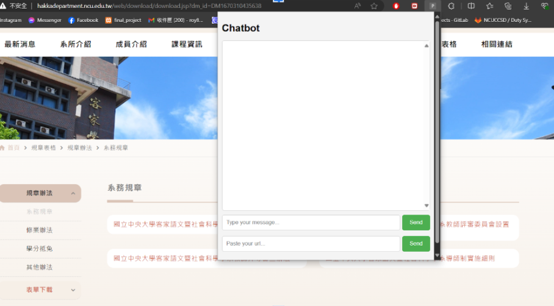
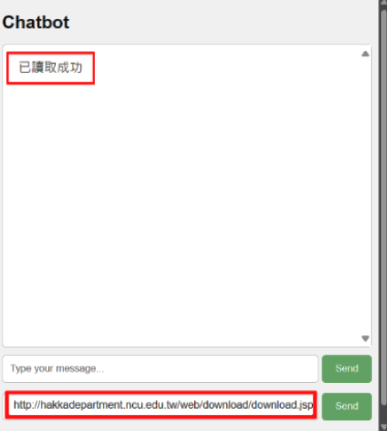

# dataScout

dataScout 是一個能夠快速讀取網頁中的所有 PDF 內容，並讓使用者透過與 Bot 問答 的方式輕鬆了解 PDF 文件的重點與細節。此系統透過即時交互的方式，大幅提升了資料檢索的效率。

## 系統架構
dataScoutGPT的架構設計結合了Embedding技術與大語言模型，以滿足複雜查詢的需求。在這一架構中，選擇bge-m3作為主要的嵌入模型，而Gemini則作為大語言模型進行查詢處理。整體架構旨在實現快速且準確的資料檢索。

## 系統流程

1. 爬蟲抓取網頁PDF

    本系統利用DOM解析技術動態抓取網頁中的PDF檔案，並透過標籤篩選與關鍵字（如.pdf）識別連結，確保能夠有效獲取各種PDF檔案。為防止網站的防爬蟲機制阻擋，系統採用代理伺服器（proxy）繞過IP封鎖與User-Agent檢查，保證抓取穩定性。對於非PDF格式的檔案，系統會自動將Word、Excel等檔案轉換為PDF，統一管理和儲存，便於後續的資料處理與檢索。

2. Embedding 模型與資料儲存
    利用Embedding將PDF內容轉換為文字向量，系統將轉換後的向量儲存至資料庫中，便於快速檢索和更新。對於含有表格的PDF文件，系統使用pdfplumber來精確地切割和提取表格數據，確保表格中的信息可以正確轉換為結構化格式並進行進一步處理，避免資料損失或結構錯亂。

3. LLM+DB 統整與回應模塊
    整合了LLM和Database來生成使用者的回應。首先，根據使用者的查詢從向量資料庫中利用向量查詢檢索資料片段（chunks），根據所選擇的chunk大小，回應時間可能會有所不同。

4. Google Extension 開發
    將Google Extension套件與後端連接，以Flask做為後端框架，利用網頁爬蟲抓處當前網頁的PDF檔案，讀取使用者的prompt，進行向量查訊後，再將結果交由LLM，最後生成使用者回應。

## 演示

1. 開啟套件
    

2. 輸入網址
    

3. 輸入訊息/LLM回答
    

4. 對比實際規範
    
